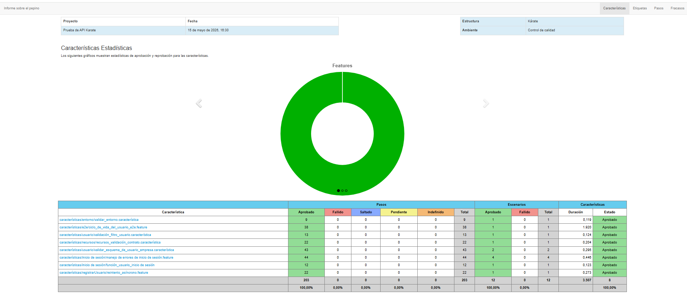
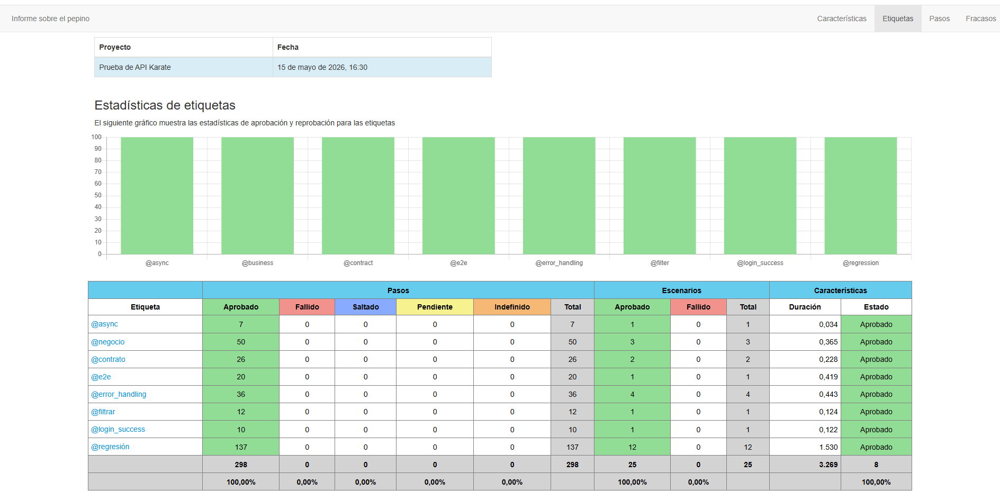

#  API Karate Test Framework

Framework de automatización de APIs desarrollado con:

* Karate DSL
* Maven
* JUnit 5
* Cucumber Reporting
* GitHub Actions
* Java 21

El objetivo del proyecto es implementar un framework moderno para automatización de APIs, incluyendo validaciones funcionales, validaciones de contrato, lógica de negocio, pruebas E2E y ejecución CI/CD automatizada.

#  Separación de responsabilidades

El framework separa:
* Payloads reutilizables (`data/`)
* Schemas JSON (`schemas/`)
* Escenarios funcionales (`features/`)
* Configuración global (`karate-config.js`)

Esto mejora:
* mantenibilidad
* reutilización
* escalabilidad
* legibilidad

#  Configuración centralizada

En `karate-config.js` se implementó:
* baseUrl
* API Key
* Headers globales
* Manejo de ambientes
* Timeouts
* Variables reutilizables

# Manejo de ambientes

Se implementó:

```javascript
var env = karate.env || 'qa';
```
permitiendo ejecutar pruebas en distintos ambientes:
* QA
* UAT

# Payloads externos reutilizables

Los datos de prueba fueron externalizados en archivos JSON:
Esto evita hardcodear información dentro de los escenarios.

# Datos dinámicos

Se implementó generación dinámica de datos:
Esto evita colisiones de datos y mejora la estabilidad de las pruebas.

# Reutilización de Features

Se utilizó:

```karate
callonce read(...)
```
para reutilizar flujos entre escenarios.

# Validación de Login Exitoso

Archivo:

```plaintext
login_user.feature
```
Validaciones implementadas:
* status 200
* Content-Type JSON
* token válido
* longitud mínima del token
* logs de ejecución
Además:
```karate
def result = { token: sessionToken }
```
permite reutilizar el token en otros flujos.

# Validaciones Negativas (Unhappy Paths)
Archivo:
```plaintext
login_error_handling.feature
```
Implementa:
* password vacío
* email vacío
* ambos vacíos
* usuario inexistente

Usando:

```karate
Scenario Outline
Examples
```
Además:

* validación de schema de error
* validación de performance
* validación de mensajes esperados


# Registro de Usuario

Archivo:

```plaintext
register_user.feature
```

Validaciones:

* status 200
* token válido
* id generado dinámicamente
* reutilización del ID

# Retry Until (Asíncrono)

Archivo:

```plaintext
asynchronous_retry.feature
```
Implementa:

```karate
retry until
```
Muy utilizado en sistemas asincrónicos para:

* polling
* propagación de datos
* procesamiento eventual

# Validaciones de Contrato

Archivos:

```plaintext
schemas/
```
Schemas implementados:

* single_user_schema.json
* resource_item_schema.json
* login_error_response_schema.json

Validaciones utilizadas:

```karate
#string
#number
#regex
```
Además de validaciones avanzadas:

```karate
'#number? _ > 0'
```

## ✅ Validaciones de Negocio

Archivo:

```plaintext
validate_user_schema_business.feature
```

Implementa validaciones reales de negocio:

* email válido
* avatar con URL válida
* IDs positivos
* longitud mínima de nombres
* validación de URLs
* validación de metadata

Además:

```karate
match contains
assert
regex
```

# Validaciones de Recursos

Archivo:

```plaintext
resources_contract_validation.feature
```

Implementa:

* validación de arrays
* paginación
* validación de metadata
* validación de URLs HTTPS
* validación de performance

Además:

```karate
match each
```
para validar listas completas usando schemas externos.

#  Uso Avanzado de karate.filter

Archivo:

```plaintext
user_filter_validation.feature
```
Implementa:

```karate
karate.filter()
```

Ejemplo:

```karate
karate.filter(users, function(x){ return x.first_name == 'George' })
```
Esto demuestra manejo avanzado de arrays y funciones JavaScript en Karate.

# Flujo E2E Completo

Archivo:

```plaintext
user_lifecycle_e2e.feature
```

Flujo implementado:

```plaintext
Registro
→ Consulta
→ Actualización
→ Eliminación
```

Implementa:

* reutilización de registro
* datos dinámicos
* payload externo
* validaciones de negocio
* limpieza de datos

#  CI/CD con GitHub Actions

El proyecto implementa pipeline CI/CD con GitHub Actions.

#  Ejecución Local

Ejecutar todas las pruebas:

```bash
mvn clean test
```

Ejecutar regresión:

```bash
mvn clean test -Dkarate.options="--tags @regression"
```

#  Visualización de Reportes Cucumber

Después de ejecutar el pipeline en GitHub Actions, los reportes automatizados quedan disponibles como artifacts descargables.

# Cómo descargar el reporte

1. Ir a la pestaña **Actions** del repositorio.
2. Seleccionar la ejecución del workflow.
3. En la sección **Artifacts**, descargar:

```plaintext
karate-api-test-reports.zip
```

4. Descomprimir el archivo descargado.

# Cómo visualizar el reporte Cucumber

Abrir en el navegador el siguiente archivo:

```plaintext
karate-api-test-reports/
└── cucumber-report/
    └── cucumber-html-reports/
        └── overview-features.html
```
Asi se veran los reportes 



#  Características Avanzadas Implementadas

✅ Contract Testing
✅ Business Validation
✅ Retry Until
✅ Dynamic Data
✅ Reusable Features
✅ External Schemas
✅ Scenario Outline
✅ API Filtering
✅ E2E Flows
✅ CI/CD
✅ Cucumber Reporting
✅ Environment Management
✅ Tags Strategy
✅ JSON Schema Validation
✅ Regex Validation
✅ Performance Assertions
